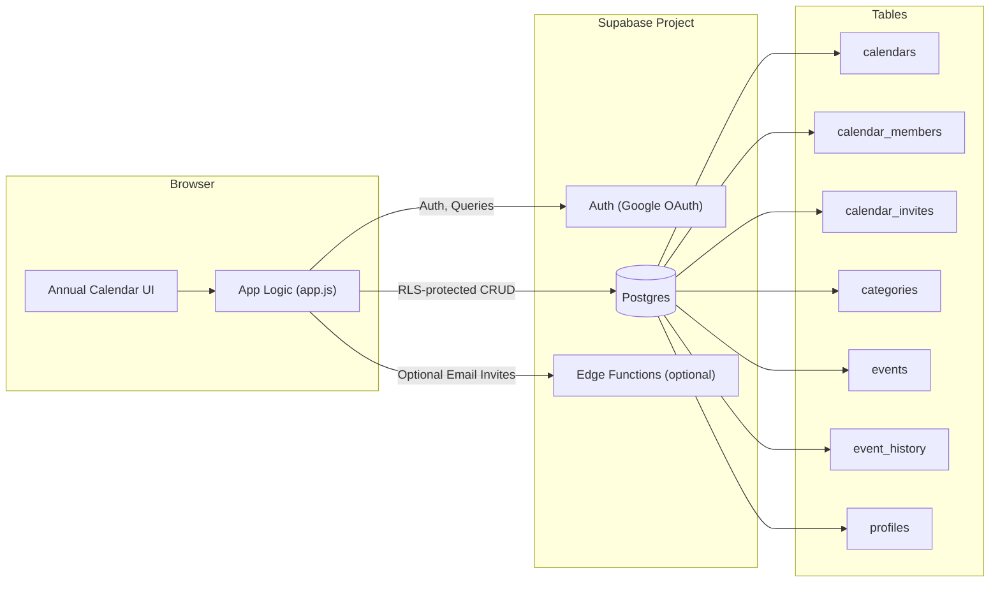

# Hudson Hill Yearly Calendar

A single-page, linear annual calendar designed for shared planning. It renders all 12 months at once, supports categories, recurring events, and collaborative sharing via invite links.

## Features
- Annual view with one row per month and 31 day columns
- Multi-day event bars and drag-to-create across days and months
- Category pills for filtering and color management
- Event popup for view/edit, descriptions, and history
- Recurrence (daily/weekly/monthly/yearly) with safe time validation
- Shared calendars with owner/editor/viewer roles
- Invite links (no email required) with login-gated acceptance

## Tech Stack
- Frontend: Vanilla HTML, CSS, and JavaScript
- Hosting: Vercel
- Auth + Database: Supabase
- Optional email invites: Supabase Edge Functions + Resend (not required)

## Architecture


## Local Development
```bash
cd "/Users/jonathanchen/Documents/New project/annual-calendar"
python3 -m http.server 5173
```
Open: `http://localhost:5173`

## Environment Configuration
Supabase is configured in `index.html`:
```html
<script>
  window.__SUPABASE__ = {
    url: "https://upvbltmtwiujbaafmyty.supabase.co",
    anonKey: "<publishable_key>"
  };
</script>
```

## Database Schema (Core)
- `calendars`: calendar records, owner
- `calendar_members`: membership and roles
- `calendar_invites`: invite tokens
- `categories`: category name and color
- `events`: event data, recurrence, description
- `event_history`: change log
- `profiles`: user display metadata

## Collaboration Flow (Invite Links)
1. Owner or editor clicks **Copy Invite Link**.
2. App inserts a token into `calendar_invites`.
3. Friend opens link and signs in.
4. App accepts invite and inserts row into `calendar_members`.
5. Member appears under **Shared With**.

## Notes
- Calendars are private by default.
- Only owners and editors can invite others.
- Viewers are read-only.

## Deployment
- GitHub repo: `puzol710/yearly-calendar`
- Vercel auto-deploys from `main`.

